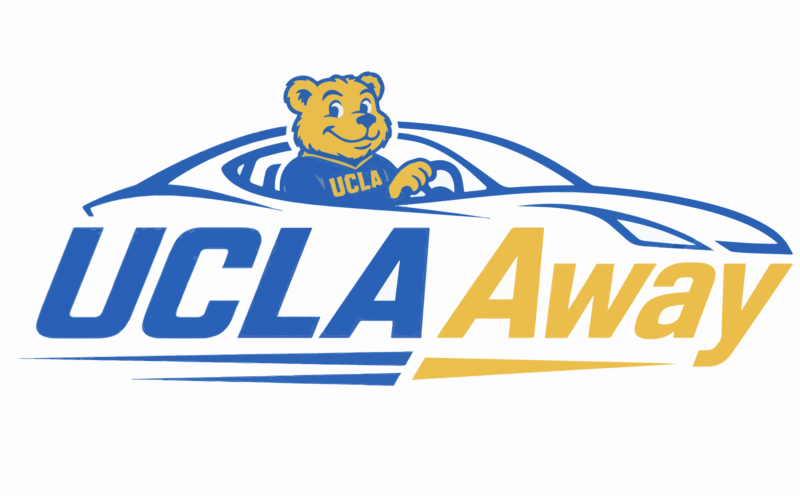

## Table of Contents

- [Project Overview](#project-overview)
- [Tech Stack](#tech-stack)
  - [Frontend](#frontend)
  - [Backend Architecture](#backend-architecture)
- [Getting Started with UCLAway](#getting-started-with-uclaway)
  - [Backend Setup](#backend-setup)
  - [Frontend Setup](#frontend-setup)
  - [Supabase Setup](#supabase-setup)
- [Running Tests](#running-tests)
- [Features](#features)
- [User Security and Privacy](#user-security-and-privacy)
- [AI Usage Disclaimer](#ai-usage-disclaimer)
- [Credits](#credits)

## Project Overview
### Our motivation: 
Getting places in LA from UCLA is harder than it should be. Currently, students rely on scattered Discord servers, facebook groups, and group chats to find rides. There is no central hub to both search and post a carpool listing. This makes the process inefficient, especially for someone who needs to find a ride quickly. Additionally, sharing a car with a random person from the internet can be risky. Sharing with a verified UCLA student is much more reliable and comfortable. Save money, time, and pain with our solution, UCLAway. Built by UCLA students, for UCLA students. 

### UCLAway, our solution 
Our project is a carpooling web application specifically for UCLA students to make ride-sharing easier, safer, and more efficient. Users can create public ride posts that include important details such as date, time range, pickup location, destination, and the number of available seats. Other users can view these posts on the ride feed and join rides with open seats. Every ride post also shows its current status, such as “missing 2” or “full,” so users can quickly see availability. In addition, each user has a profile page containing contact information, ride history, and the number of rides they have completed. Users can edit, and delete rides that they have published, along with the ability to remove riders from their own postings. Each user has a username, and can message a user either through clicking the users detail on a ride page, or searching their username. Users are able to follow each other, and on their profile page have both a follower and following count. After a ride has expired (its date has passed), it will automatically be removed from the system. So that the feed is easily navigable, users can search rides for criteria such as destination, and with the advanced filter search for criteria such as seat availability, time/date, etc. 
UCLAway only allows users with UCLA domain emails to sign-up for an account, ensuring that only UCLA affiliated students and members will be on the platform, providing increased trust for users.
Overall, our system provides UCLA students with a convenient way to coordinate transportation and connect with other students traveling in the same direction.

A tutorial with these functionalities can be viewed from this link : https://drive.google.com/file/d/1t-duXFfu2f6cPoPEby-HBpNJEKAFwzhT/view?usp=sharing

## Tech Stack
### Frontend 
- React.js
- CSS
- Fetch and Socket
- React Router
### Backend Architecture
- Nodes.js & Express
- Supabase

### How to get started with UCLAWay!
- Backend setup
  - Navigate to backend directory
`cd backend` 
  - Install backend dependencies
`npm install`
  - Start up the UCLAway backend server
`npm start`

- Frontend setup
  - Navigate to frontend directory
`cd frontend`
  - Install frontend dependencies
`npm install`
  - Start up the development server to view the UCLAway web frontend
`npm run dev`

# Supabase setup
`SUPABASE_URL` = supabase_project_url
`SUPABASE_SERVICE_ROLE_KEY` = your_supabase_API_key

# Tests
([ToDo: add steps here for how to run tests, functionalities tested, etc.]) 

### Features
- Login and Sign-up: Only UCLA emails, bcrypt password hashing
- Post Comments or Private Message to coordinate and confirm rides
- Create, join, and delete carpool groups
- Drop-Off and Pick-up locations, Pick-Up times and Ride-specific details
- Real-Time seat availability
- Search for other UCLA students who are registered with UCLAWay!

### User security and privacy
- Regex credential verification for password and ucla email
- Password requirements
  - At least one upper-case letter, lower-case letter, digit, and special character. 8 character minimum. 
- JSON Web Token (JWT) Authentication for user identification
    - Components: JWT secret key (base-64 encoded), unique user id, student's UCLA email
    - Generated upon login and stored in browser localStorage (outside of the backend server). Token deleted upon logout. Also, since the JWT expires after 1 hour, the user is logged out upon expiration. 

### AI Usage Disclaimer
The following were developed with AI assistance. 

- The logo was generated by GPT-5.5 Thinking, and converted from PNG to SVG via Adobe Express. 
Prompt: "Create a modern and clever logo for a UCLA student ridesharing app. Model this logo to be interactive and have a character such as a bruin. Use UCLA school colors. Make the logo clever similar to the FedEx logo arrow. Keep it professional and fun." 
Generated the image first try, prompted for change in bears features and apparel. Added the Hex's for UCLA blue and Gold. UCLA Blue: #3976AF, UCLA Gold: #FFD100. Then I converted this to a PNG via Adobe Express. 

- Identifying potential merge and rebase conflicts was supported using GPT-5.5.
Prompt: What potential problems should I watch for when merging or rebasing my feature branch onto a newer shared main branch, especially if both branches changed backend routes, frontend components, and database-related logic?

- The test suite for this project was partially AI generated using Claude Sonnet 4.7 model.
Prompt: Help me write a partial test suite for my rideshare app backend. I need tests for ride creation, filtering by location/date/seats, joining and leaving rides, and follow/unfollow behavior. Please generate a readable starting point that I can edit and verify manually.

Teammate specific in depth AI usage will be reflected in personal final project reports & AI assisted code is marked within the repository. 

### Credits
Built by the UCLAway team for CS35L Final Project.

Our Team Contributors: Pranav Bodapati, Thomas Lien, Nicole Weimar, Bowen Fu, Haotong (Isabella) Hu

Feel free to provide your input or feedback to our project!

